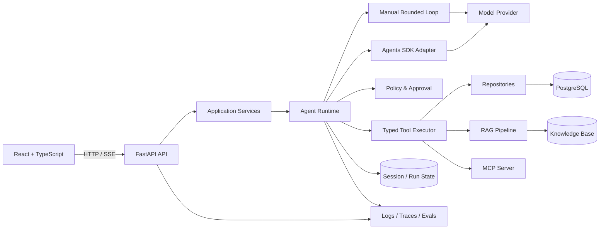

# DevSupport Agent

> **WIP · Week 01 / 16** — 当前处于 Python 工程基础阶段；仓库会随着学习路线逐周演进，尚未发布可用版本。

一个面向真实工程场景的开发者支持 Agent：它将能够检索带出处的技术资料、查询 Issue 与故障信息，并在明确的权限、审批和执行预算内调用工具。

这个仓库既是最终作品，也是完整的工程学习记录。目标不是展示一个“能聊天”的 Demo，而是证明我能够定义需求、设计边界、审查 AI 生成的代码，并用测试与评测结果验证系统行为。

## 项目价值

开发团队经常需要在文档、Issue、运行手册和故障记录之间来回查找信息。DevSupport Agent 计划把这些信息与受控操作统一到一条可追踪的工作流中：

- 根据内部知识库回答问题，并返回可核验的引用；
- 查询 Issue、版本发布记录和历史故障；
- 通过类型化工具执行受控操作，而不是让模型直接接触数据库；
- 对写操作要求人工审批，并保证幂等性；
- 保存 Agent 运行状态，支持超时、取消、恢复与故障排查；
- 使用固定评测集衡量任务成功率、工具选择、引用质量、延迟和成本。

## 计划能力

| 能力 | 目标 | 当前状态 |
|---|---|---|
| Issue 工作流 | 创建、查询和更新 Issue，具备身份隔离与幂等保护 | 规划中 |
| Agent Runtime | 手写有界循环与 Agents SDK 双引擎对照 | 规划中 |
| 会话与记忆 | 隔离的会话状态、上下文管理与可控记忆 | 规划中 |
| RAG | 文档导入、检索、引用与可重复评测 | 规划中 |
| 工具安全 | Schema 校验、超时、权限检查和人工审批 | 规划中 |
| MCP | 以标准协议暴露受控的开发支持能力 | 规划中 |
| 可观测与评测 | Trace、错误分类、确定性测试和真实模型评测 | 规划中 |
| Web UI | React + TypeScript 的会话、引用和审批界面 | 规划中 |

状态会以代码、测试和评测证据为准，而不是以功能描述为准。

## 目标架构



核心调用链计划保持清晰：

```text
用户输入
→ API 校验与身份识别
→ Agent 状态机
→ 模型请求结构化工具调用
→ 权限、参数、审批和预算检查
→ 工具执行并保存结果
→ 模型生成带证据的答复，或触发明确停止条件
```

预计采用以下仓库边界：

```text
frontend/          React + TypeScript Web UI
backend/           FastAPI、领域服务、Agent 与数据访问
mcp_server/        MCP 能力（对应阶段开始时加入）
knowledge_base/    仅含可公开的模拟文档
evals/             固定用例、评分器与评测报告
labs/              不被正式项目依赖的概念实验
docs/              周记、规格、ADR、图示与 AI debt
```

目录会按周渐进创建，避免用大量空文件制造“已经完成”的假象。

## 工程原则

- **契约优先**：先定义输入、输出、错误与验收标准，再实现功能。
- **分层与可替换**：Route 不直接访问数据库，外部模型和工具通过边界适配。
- **默认不信任模型输出**：所有结构化输出都在 Python 侧再次校验。
- **有界执行**：Agent 具备时间、token、工具次数、重复调用和取消限制。
- **最小权限**：读写能力分离；身份隔离在后端强制执行；危险写操作进入审批。
- **失败也是产品行为**：超时、重试、回滚、幂等和恢复都有明确语义。
- **证据驱动**：功能完成需同时具备测试、评测或可复现的运行证据。
- **小步合并**：`main` 始终保持可运行，实验代码不得被正式代码依赖。

## 质量证据

当前尚未建立基线；下列指标会在对应阶段由固定数据集生成并链接到评测报告。

| 指标 | 当前结果 | 目标证据 |
|---|---:|---|
| 后端测试 | 尚未运行 | CI 中的单元、API 与数据库测试 |
| 任务成功率 | 尚未评测 | 版本化 eval cases |
| 工具选择准确率 | 尚未评测 | 确定性用例 + 真实模型抽样 |
| 引用支持率 | 尚未评测 | 人工标注答案与引用 grader |
| 未授权写操作 | 尚未评测 | 越权、注入与审批绕过测试 |
| 延迟与成本 | 尚未测量 | 固定模型、固定样本的报告 |

## 快速开始

> 当前初始化阶段还没有可运行应用。以下命令会在相应模块落地后替换为经过 CI 验证的真实步骤。

```bash
git clone https://github.com/yuqiao-yq/devsupport-agent.git
cd devsupport-agent
cp .env.example .env

# 后端（待 Week 01–04 落地）
cd backend
uv sync
uv run pytest
uv run fastapi dev app/main.py

# 前端（待 Week 04 落地）
cd ../frontend
pnpm install
pnpm dev
```

真实密钥只能写入本地 `.env` 或部署平台的密钥管理系统，不能提交到 Git。

## 学习与交付路线

16 周计划分为四个里程碑：

1. **Weeks 01–04 · Backend Foundation**：完成可测试、可迁移、可由前端调用的 API，发布 `v0.1`。
2. **Weeks 05–10 · Agent Core**：完成 Structured Outputs、Function Calling、手写有界循环、Agents SDK 对照、会话记忆与 RAG，发布 `v0.2`。
3. **Weeks 11–15 · Production Engineering**：完成审批与持久化状态机、Python MCP、单/多 Agent A/B、Eval、Tracing、安全和部署故障演练，发布 `v0.3`。
4. **Week 16 · Portfolio**：完成可复现演示、工程证据和求职材料，发布 `v1.0`。

每周目标与可核验验收项见 [ROADMAP.md](./ROADMAP.md)。详细学习证据将保存在 `docs/weeks/`，重要技术取舍保存在 `docs/adr/`。

当前文档入口：

- [Week 01 学习记录](./docs/weeks/week-01.md)
- [仓库初始化规格](./docs/specs/0001-initialize-learning-repository.md)
- [单仓库架构决策](./docs/adr/0001-product-first-single-repository.md)
- [AI Debt](./docs/ai-debt.md)
- [安全规则](./SECURITY.md)

## AI-Assisted Development

本项目会主动使用 AI 完成脚手架、实现草稿、测试初稿和文档整理，但不会把“AI 生成”视为正确性证明。

我始终负责：

- 明确问题、约束、非目标与验收标准；
- 设计架构、安全边界和工具权限；
- 审查代码、数据库迁移与 API 契约；
- 定义评测集的预期答案和失败场景；
- 运行测试、解释调用链，并在 AI 出错时接管修复；
- 对最终技术决策和公开指标负责。

尚未真正理解的 AI 生成代码会记录在 `docs/ai-debt.md`，而不是被默认为已掌握。

## 安全与数据提醒

本仓库只允许使用模拟数据和可公开资料。请勿提交：

- API Key、Cookie、Token、`.env` 或数据库备份；
- 公司内部代码、文档、日志、真实用户数据和未脱敏 Trace；
- 含敏感信息的原始模型输入输出；
- 未验证的准确率、成功率或安全结论。

模型输出、检索内容与 MCP Server 均按不可信输入处理。若密钥曾进入 Git 历史，应立即撤销并重新生成；仅删除文件并不能消除泄露风险。

## 当前下一步

- 建立 Python 项目、领域模型和测试入口；
- 使用 Pydantic 定义 Issue 数据边界；
- 通过 Service、Repository、JSON 存储与 CLI 跑通第一个 Issue 用例；
- 记录首个规格与架构决策；
- 用 CI 验证 lint、类型检查和 pytest。
